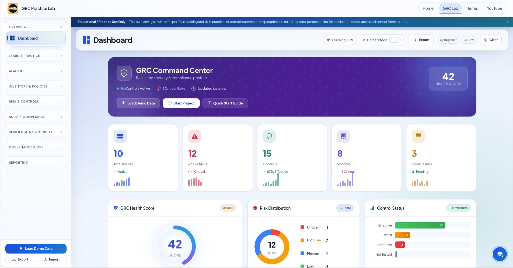
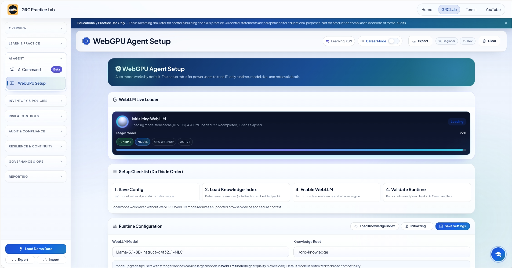

# 🛡️ GRC Practice Lab
## From Theory to Real-World GRC Execution

A browser-based, hands-on Governance, Risk & Compliance (GRC) simulation platform designed to help professionals practice real workflows — not just memorize frameworks.

**Links**
- 🌐 Live Platform: https://johnbjoseph-cybersec.github.io/
- 🔗 LinkedIn: https://www.linkedin.com/in/johnbjosephcybersec/
- 🎥 YouTube: https://www.youtube.com/@GRCMadeSimple

---

## 🚀 The Problem

Most GRC learning today is:
- Theory-heavy  
- Certification-focused  
- Tool-dependent  
- Not portfolio-ready  

You can pass ISO 27001.  
You can memorize SOC 2.  
But can you execute?

This platform bridges that gap.

---

## 🎯 What You Can Do Inside

- Build structured Risk Registers  
- Map Controls to Risks  
- Generate Statement of Applicability (SoA)  
- Track Evidence  
- Simulate Audit Workflows  
- Run ISO / SOC-style Projects  
- Visualize Inherent vs Residual Risk  
- Use an integrated GRC AI Copilot  

**Works with:**
- ✅ No installation  
- ✅ No signup  
- ✅ No backend  
- ✅ 100% client-side  
- ✅ All data remains local  

---

## ⚡ GRC AI Agent (WebGPU + WebLLM)

Version 3 introduces an on-device AI copilot built with:
- WebGPU  
- WebLLM  
- Local model inference  
- Embedded retrieval  

It can evaluate:
- Your risks  
- Your controls  
- Your evidence  
- Your project structure  

Runs entirely in your browser:
- No external APIs  
- No data transmission  

**Learning loop:** Practice → Feedback → Refine → Elevate

---

## 🧩 Framework Coverage (400+ Controls)

- ISO/IEC 27001  
- NIST CSF  
- CIS Controls  
- SOC 2  
- PCI DSS  
- HIPAA  
- COBIT  
- GDPR  
- UAE IA (practice aligned)  

---

# 📷 Platform Overview

## 🏠 GRC Command Center

## 📊 Community Engagement

Launched February 2026  
2,800+ active users  
79,000+ hands-on interactions  
150+ GRC practitioners validating the platform  

## 🎯 Guided Practice Scenarios

## 🔥 Risk Matrix & Analytics

## ⚡ WebGPU Runtime

## 🤖 AI Command Console

---

## 🖥️ How To Use

1. Clone or download this repository  
2. Open `grc-lab.html` in a modern browser  
3. Start building your GRC environment  

---

## 📌 Who This Is For

- Career switchers  
- Entry-level analysts  
- Mid-level compliance professionals  
- Students building portfolios  
- Audit-focused practitioners  

---

## 📬 Connect

- 🌐 Website: https://johnbjoseph-cybersec.github.io/  
- 🔗 LinkedIn: https://www.linkedin.com/in/johnbjosephcybersec/  
- 🎥 YouTube: https://www.youtube.com/@GRCMadeSimple  
- 📧 Email: johnbjoseph.cybersec@gmail.com  

---

## ⚠️ Disclaimer

Educational and portfolio practice only.  
Not intended for production compliance decisions.

Licensed under **Creative Commons BY-NC 4.0** (commercial use requires written permission).
